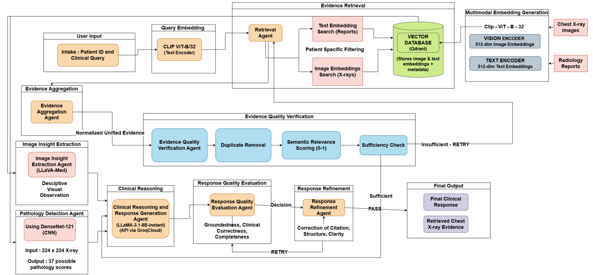

# A Multi-Agent Multimodal RAG Framework for Clinical Decision Support

> **Team 22 | Amrita School of Computing, Amrita Vishwa Vidyapeetham, Coimbatore**
> B.Tech Computer Science and Engineering — March 2026

---

## Overview

This project presents a **Multi-Agent Multimodal Retrieval-Augmented Generation (RAG)** framework designed for safe, evidence-driven chest radiograph interpretation. The system integrates automated pathology detection, multimodal semantic retrieval, and quality-gated agentic reasoning to deliver trustworthy clinical decision support.

Unlike conventional linear RAG pipelines, this framework models the diagnostic process as a **cyclical state machine** (via LangGraph), decomposing clinical reasoning into specialized, verifiable stages with adaptive retry loops and quality gates at every step.

---

## Key Results

| Metric | Score |
|--------|-------|
| Pathology Detection (Micro-avg AUROC) | **0.85** |
| Evidence Retrieval (Precision@K / Recall@K / MRR) | **0.97** |
| Clinical Response Groundedness | **0.70** |
| Completeness | **0.99** |

---

## Architecture

The pipeline is orchestrated using **LangGraph** as a directed cyclic graph with persistent shared state. The core stages are:



---

## Features

- **37-Class Pathology Detection** — DenseNet-121 trained on automatically discovered pathology classes from IU-CXR MeSH annotations (vs. the standard 14-class NIH benchmark).
- **Multimodal Semantic Retrieval** — CLIP ViT-B/32 aligns chest X-ray images and radiology report text in a shared 512-dimensional embedding space, stored and queried via Qdrant.
- **Quality-Gated Agentic Pipeline** — Two-tier verification: Evidence Quality Gate (cosine similarity threshold) and Response Quality Gate (weighted composite score across groundedness, completeness, clinical correctness, actionability, and discordance handling).
- **Adaptive Retry Loops** — Evidence retrieval and response generation both support configurable retry limits, preventing catastrophic failure on low-quality inputs.
- **Safety-Verified Reasoning** — Mandatory hedging language, prohibition of direct medical orders, evidence-backed citations, and epistemic humility enforcement via a Clinical Safety Validator.
- **Discordance Detection** — Explicit flagging when DenseNet CNN findings contradict text report evidence.
- **Separation of Perception and Reasoning** — LLaVA-Med handles visual observation; Llama-3.1 handles diagnostic synthesis. This prevents anchoring bias.
- **Web Interface** — Clean HTML/JS frontend served via FastAPI, with an interactive pathology bar chart (Chart.js), pipeline execution summary, quality gate scores, and evidence viewer.

---

## Tech Stack

| Component | Technology |
|-----------|------------|
| Orchestration | LangGraph v0.0.34, LangChain Core |
| Vector Database | Qdrant v1.7.4 |
| Image-Text Embeddings | CLIP ViT-B/32 (SentenceTransformers + fastembed) |
| Pathology Detection | DenseNet-121 (PyTorch 2.1.0 + torchvision) |
| Visual Analysis | LLaVA-Med-v1.5-Mistral-7B (Ollama) |
| Clinical Reasoning | Llama-3.1-8B-Instant (Groq Cloud API) |
| Groundedness Evaluation | RAGAS Faithfulness (LLM-as-judge via Groq) |
| Clinical Correctness | SentenceTransformers `all-MiniLM-L6-v2` (cosine similarity) |
| Backend API | FastAPI + Uvicorn |
| Frontend | HTML5 / CSS3 / JavaScript + Chart.js |
| Dataset | Indiana University Chest X-ray Collection (IU-CXR) |

---

## Dataset

The framework uses the **Indiana University Chest X-ray (IU-CXR) Collection** — a publicly available dataset from the US National Library of Medicine.

- 7,470 frontal and lateral chest radiographs from 3,955 unique patients
- Paired radiology reports (Indication, Comparison, Findings, Impression sections)
- MeSH annotations and problem lists used for automated pathology class discovery
- Accessed via Kaggle (PNG images + combined CSV metadata)

The automated pathology discovery pipeline extracts 37 clinically valid pathology classes from MeSH metadata with a minimum occurrence threshold of 20, covering 89.3% of all pathological references in the dataset.

**Dataset split (patient-level stratified):**

| Split | Images | Patients |
|-------|--------|----------|
| Train | ~5,200 | ~2,770 |
| Validation | ~1,120 | ~593 |
| Test | ~1,120 | ~593 |

---

## Project Structure

```
.
├── agents/
│   ├── langgraph_flow/
│   │   └── mmrag_graph.py          # Main LangGraph pipeline definition
│   ├── verifiers/
│   │   ├── clinical_safety_validator.py
│   │   ├── evidence_quality_verifier.py
│   │   ├── response_refiner.py
│   │   ├── structure_repair.py
│   │   └── xray_retrieval_contract.py
│   ├── quality_gates/
│   │   ├── evidence_quality_gate.py
│   │   └── response_quality_gate.py
│   ├── clinical_reasoning_agent.py
│   ├── evidence_aggregation_agent.py
│   ├── image_insight_agent_llava_med.py
│   ├── pathology_detection_agent.py
│   └── xray_agent.py
├── embeddings/
│   ├── image_embeddings.py         # CLIP image encoder
│   └── text_embeddings.py          # CLIP text encoder (fastembed)
├── evaluation/
│   └── diagnosis_evaluator.py      # Precision@K, Recall@K, MRR, Groundedness, etc.
├── frontend/
│   └── index.html                  # Web UI
├── ingestion/
│   ├── ingest_to_qdrant.py         # Batch ingestion into Qdrant
│   └── preprocess_dataset.py
├── pathology_detection/
│   ├── models/
│   │   └── densenet_classifier.py  # DenseNet-121 model definition
│   ├── training/
│   │   ├── config.py
│   │   ├── dataset.py
│   │   ├── prepare_dataset.py      # Automated pathology discovery
│   │   └── train.py
│   └── evaluation/
│       └── evaluate.py             # ROC-AUC, confusion matrix, per-class metrics
├── utils/
│   ├── logger.py
│   └── report_parser.py
├── vectorstore/
│   └── qdrant_setup.py
├── api.py                          # FastAPI backend
├── streamlit_app.py                # Streamlit alternative UI
├── test.py                         # Batch evaluation script
├── environment.yml
└── requirements.txt
```

---

## Setup & Installation

### Prerequisites

- Python 3.10
- Conda (recommended)
- CUDA-capable GPU (RTX 3090 or equivalent with ≥24 GB VRAM recommended)
- [Ollama](https://ollama.ai/) installed and running (for LLaVA-Med)
- A [Groq Cloud](https://console.groq.com/) API key (free tier available)

### 1. Create Environment

```bash
conda env create -f environment.yml
conda activate mmrag-clinical
pip install -r requirements.txt
```

### 2. Configure Environment Variables

Create a `.env` file in the project root:

```env
GROQ_API_KEY=your_groq_api_key_here
```

### 3. Download & Prepare Dataset

Download the IU-CXR dataset from Kaggle and place it in `data/raw/`. Then:

```bash
# Prepare labeled dataset with automated pathology discovery
python pathology_detection/training/prepare_dataset.py
```

This generates `data/processed/train_labels.csv`, `val_labels.csv`, `test_labels.csv`, and `dataset_metadata.json`.

### 4. Train Pathology Detection Model

```bash
python pathology_detection/training/train.py
```

The best checkpoint is saved to `pathology_detection/weights/best_model.pth`. Training uses cosine LR scheduling with early stopping (patience = 5).

### 5. Ingest Data into Qdrant

```bash
python -m ingestion.ingest_to_qdrant
```

### 6. Pull LLaVA-Med via Ollama

```bash
ollama pull z-uo/llava-med-v1.5-mistral-7b_q8_0
```

### 7. Start the API Server

```bash
uvicorn api:app --host 0.0.0.0 --port 8000 --reload
```

Then open `http://localhost:8000` in your browser.

**Alternatively, run the Streamlit UI:**

```bash
streamlit run streamlit_app.py
```

---

## Usage

1. Open the web interface at `http://localhost:8000`.
2. Enter a **Patient ID** (integer, matching IU-CXR patient IDs).
3. Type a **Clinical Query**, e.g.:
   - *"Is there any sign of pleural effusion?"*
   - *"Are there signs of cardiomegaly?"*
   - *"What are the findings in the chest X-ray?"*
4. Click **Analyze**. The pipeline will execute through all agents and return a structured clinical response with grounded citations, pathology detection results, and quality scores.

### Response Format

Every clinical response follows a four-section structure:

```
Clinical Impression:
  [One-sentence radiological conclusion + confidence indicator]

Evidence Synthesis:
  [Observations from text reports and image analysis, each with citations]
  [Discordance Note if CNN and text report contradict each other]

Differential Considerations:
  - Primary: [Most likely diagnosis + supporting evidence]
  - Alternative: [Alternative diagnosis + reason it is less likely]
```

---

## Evaluation

Run batch evaluation over a set of queries defined in `trial.xlsx`:

```bash
python test.py
```

Results are saved to `mmrag_evaluation_results.xlsx` with per-query metrics including Precision@K, Recall@K, MRR, Groundedness (RAGAS), Clinical Correctness, Completeness, Actionability Score, and Contradiction Flag.

To evaluate the pathology detection model independently:

```bash
python pathology_detection/evaluation/evaluate.py
```

This produces per-class AUROC scores, an aggregated confusion matrix, and ROC curves.

---

## Configuration

Quality thresholds and retry limits can be adjusted in the Streamlit sidebar or passed directly to the API:

| Parameter | Default | Description |
|-----------|---------|-------------|
| `evidence_threshold` | 0.4 | Minimum cosine similarity for evidence to pass the quality gate |
| `response_threshold` | 0.7 | Minimum weighted score for the response quality gate |
| `max_retrieval_retries` | 2 | Maximum retrieval + aggregation cycles before forcing proceed |
| `max_refinement_retries` | 2 | Maximum response refinement cycles before force-finalizing |

---

## Limitations & Future Work

- Currently limited to chest radiographs (XRAY modality only). Future work includes CT and MRI support via volumetric foundation models.
- The RAGAS groundedness judge depends on Groq API availability; a local fallback (citation-based scoring) activates automatically when unavailable.
- Extending to structured knowledge graphs would enable causal reasoning beyond data-driven correlations.
- Real-time clinical indicators (lab values, longitudinal patient history) are not yet integrated.
- Validation in live clinical environments and human-centered explainability studies are planned.

---

## Demo Video

https://github.com/priyadarshinirajesh/Multimodel-RAG-Implementation/assets/Group-22-DemoVideo.mp4
---

## License

This project was developed as a final-year B.Tech project at Amrita Vishwa Vidyapeetham. All rights reserved by the authors. Not intended for clinical deployment without appropriate regulatory clearance.

---

